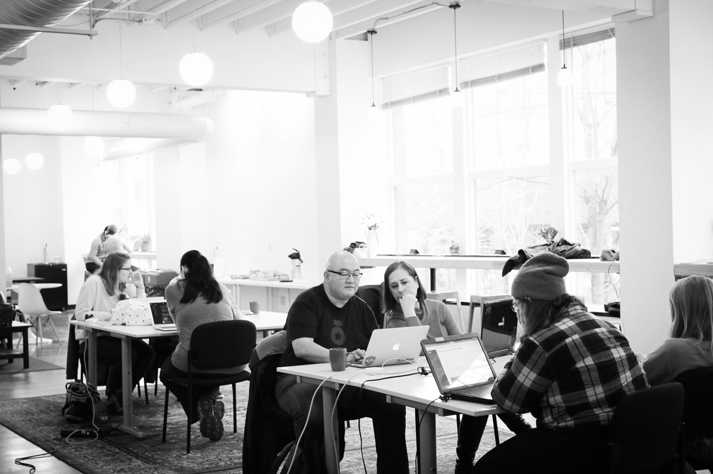

# Alchemy Is Hiring a Frontend Instructor-Developer!

Want to help shape what web design and development means for a new generation of developers? Do you get excited about crafting accessible UI/UX? If so, Alchemy is hiring a Developer/Instructor and we’d love to talk with you!

You’ve made a big impact at your job, now it’s time to make a big impact in the community.

This position involves both instruction and design/development for our in-house consultancy. You do not need prior instruction experience, but should be kind, empathetic and patient as well as a strong communicator. Ability to mentor EQ, with good listening and cheerleader skills.

We have a strong history and commitment to running an inclusive program and boosting women, people of color, LGBTQ+, veterans, and other untapped talent into strong starting tech roles. Our team is invested in helping each student through their career transition, and we get a lot of satisfaction when they land their first role in tech. It’s why we do what we do, and fuels us to be excited to go to work each day. We hope you feel the same!

We also run an in-house consultancy, called “AppLab”, building MVP apps for entrepreneurs and startups targeting both web and mobile, backed by serverless technologies. It provides a great outlet for you to stay connected to developing technology projects while helping others realize their ideas.

You need to be an experienced designer/developer backed by real world experience. This position allows you to shape future software developers while being engaged in an incredible community. In addition to teaching, we’d also love to support your work on open source or passion projects. 

Bonus if you are a prepared and organized person.

Technically, we’re looking for someone with plenty of real world experience using HTML and CSS for web sites and web apps:
* Solid browser layout and design aesthetics (RWD, Flexbox, CSS Grid)
* Semantic and Accessible Web
* Web Animations and Transitions
* Image and Font Optimization
* Strong craft ethic and/or agile engineering practices
* JavaScript: Vanilla, ESNext, DOM APIs or jQuery
* Bonus for VueJS or React
* Missing anything above? Looking for a willingness to learn what you don't know.

## On the Job

Here’s what we see your first few months looking like:

### Welcome Aboard! (0 - 45 Days)

* Shadow and learn from lead instructor
* Develop rapport with students
* Actively engage with students during lab time 
* Suggest ideas to refine or expand topics
* Review and provide feedback on student code
* Help instruction staff with prep work and presenting material

### Settling In (45 - 90 Days) 

* Lead instruction on a regular basis
* Meet with students 1:1
* Manage and leverage teaching assistants 
* Make adjustments and improvements to current and future curriculum
* Manage the learning management system for your course
* Anticipate and identify student challenges and get in front of them

### Taking the Lead! (90 - 120 Days)

- Own instruction of class
- Represent Alchemy in tech community (meetups, sponsors, info sessions)
- Own modern web development curriculum
- Provide design guidance and leadership for AppLab

### Making an Impact (120+)

- Create and own style guides and design systems for AppLab
- Provide advanced "devsign" instruction for Career Track students
- Help evangelize Alchemy and support our mission of inclusivity in tech
- Attend conferences or make a significant release of your open source project

## Alchemy Instructors

Our instructors are master developers. They are actively involved in the tech community, both locally and digitally. As industry-insiders, they generously share insights, best practices, and truths about the professional world with our students.

### Powerful Communicating

Our instructors lecture to groups of 20-30 students and connect in one-on-ones with clarity and warmth.

### Empathetic & Compassionate Mentorship

We foster a safe and collaborative space for all learning styles.

We’re present and available to students, both in their technical training and professional development.

### Tech-Savvy and Digitally-Connected Visioneering

In an industry that is constantly changing, we face forward and function with a finger on the pulse of what’s next.

We leverage what we know with what excites us -- and radiate that passion in the classroom.

### Growth Mindset

Our instructors interpret and integrate feedback from students and fellow team members.

As an innovation-driven code school, we strive for mastery in the classroom and in the field.

### Professionalism

We don’t teach “getting it to work.” Rather, we teach "doing software development" through the practice of writing quality code that can be sustained and maintained.

## Next Steps

Interested? Please email us at workwithus@alchemycodelab.com

